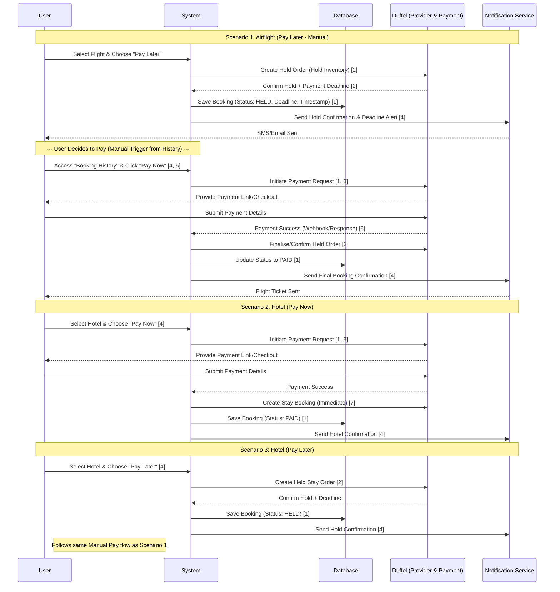
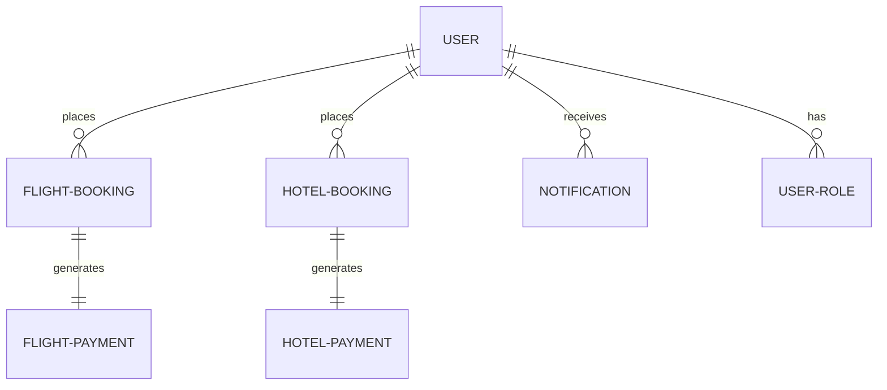

# Booking System Project - Technical Documentation

## 1. Project Overview

The Booking System Project is a dual-domain reservation platform that supports both Flight and Hotel bookings under a unified user experience. The platform integrates with Duffel as the primary external provider for inventory and payment orchestration.

Core business capabilities:

1. Flight reservations with manual Pay Later completion from booking history.
2. Hotel reservations with both Pay Now and Pay Later options.
3. Unified booking lifecycle tracking (HELD, PAID, CANCELLED, EXPIRED).
4. Transaction confirmation and customer communication via Notification Service.

Duffel responsibilities in this architecture:

1. Provide provider-side order creation/hold and confirmation.
2. Handle payment checkout link generation and payment confirmation callback.
3. Return status signals used by the system to finalize bookings.

## 2. System Actors

### Guest

1. Browse and search available flights/hotels.
2. Initiate booking flow with limited account history access.
3. Complete direct payments where supported.

### Registered User

1. Perform full booking operations across Flight and Hotel domains.
2. Use Pay Later where offered and complete payment manually from booking history.
3. Receive and track booking/payment notifications.

### Admin

1. Monitor booking and payment status across domains.
2. Verify payment outcomes and resolve operational exceptions.
3. Access daily transaction and operational reports.
4. Manage user roles and account status governance.

## 3. Functional Architecture

### 3.1 Flight Flow - Pay Later (Manual Completion)

Flight booking supports a hold-first workflow where inventory is reserved before payment is completed.

1. User selects a flight and chooses Pay Later.
2. System creates a held order with Duffel.
3. Duffel returns hold confirmation with payment deadline.
4. System stores booking with HELD status and deadline.
5. Notification Service sends hold confirmation to the user.
6. Later, user opens booking history and clicks Pay Now.
7. System initiates payment request with Duffel.
8. User completes checkout via Duffel payment link.
9. Duffel notifies the system of payment success.
10. System finalizes held order and updates booking to PAID.
11. Notification Service sends final confirmation/ticket communication.

### 3.2 Hotel Flow - Pay Now / Pay Later

Hotel booking supports both immediate and deferred payment patterns.

Pay Now path:

1. User selects hotel and chooses Pay Now.
2. System initiates payment with Duffel.
3. User completes payment in checkout.
4. On success, system creates the stay booking and stores status as PAID.
5. Notification Service sends booking confirmation.

Pay Later path:

1. User selects hotel and chooses Pay Later.
2. System creates held stay order with Duffel.
3. System stores HELD booking and deadline metadata.
4. Notification Service confirms hold status.
5. Manual payment completion follows the same history-triggered process used for flights.

### 3.3 Sequence Diagram

## 4. Data Model

### 4.1 ERD

### 4.2 Why Separate Payment Entities

Separate entities for Flight and Hotel payments are used to support domain-specific attributes, controls, and reconciliation policies.

1. Flight payment records can carry airline/order-specific metadata and settlement rules.
2. Hotel payment records can carry stay/property-specific metadata and cancellation/refund constraints.
3. Independent schemas reduce cross-domain coupling and simplify validation logic.
4. Reporting remains clearer by avoiding overloaded optional fields in a single payment table.

### 4.3 Super/Sub Booking Relationship

The booking model follows a conceptual super/sub structure:

1. Supertype (conceptual): BOOKING for shared lifecycle/state concerns (status, timestamps, ownership).
2. Subtypes (implemented): FLIGHT-BOOKING and HOTEL-BOOKING for domain-specific details.

This pattern supports a unified business workflow with specialized data paths for each service line.

## 5. Integration Details

### Duffel Payments Integration

1. Creates held orders for Pay Later scenarios.
2. Provides checkout/payment links for user payment completion.
3. Returns payment success signals (webhook/response) used for finalization.
4. Enables immediate booking creation after successful Pay Now transactions.

### Notification Service Integration

1. Sends hold confirmations and payment deadline alerts.
2. Sends final booking confirmations (ticket/stay confirmation).
3. Supports SMS and Email channels.
4. Tracks outbound notification events per user/booking.

## 6. API & Reporting

### Key API Functionalities

1. Search Criteria API:
    Support multi-parameter search for flights/hotels (date, location, occupancy, route, filters).
2. Verify Payment API:
    Validate transaction outcome and synchronize booking state transitions.
3. Booking History API:
    Retrieve held bookings and allow manual Pay Now trigger.
4. Notification Dispatch API:
    Publish and log SMS/Email confirmation events.

### Reporting Capabilities

1. Daily Transaction Reports:
    Aggregate payment totals, success/failure rates, and domain split (Flight vs Hotel).
2. Hold Conversion Report:
    Track HELD to PAID conversion performance and deadline expirations.
3. Operational Exception Report:
    Highlight payment verification failures and pending booking finalization.

## Non-Functional Notes

1. Ensure idempotent payment verification handling to avoid double-finalization.
2. Apply audit logging for status transitions and admin-level actions.
3. Enforce role-based access controls for admin reporting and verification endpoints.